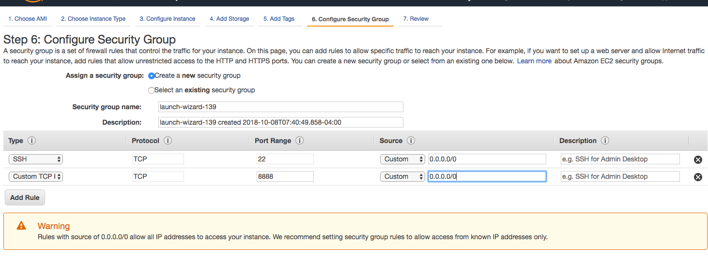

[](https://opensource.org/licenses/MIT)


# Counting Your Customers the Hard Way: Modeling Software-as-a-Serivce Usage and Churn with PyMC3

## Summary
Churn rate is an important metric for predicting the lifetime revenue of a customer in a Software-as-a-Serivce (SaaS) business. Similarly, a customer's usage of the SaaS product can give insight into the costs of servicing the customer. In this tutorial we show how to implement a probabilistic model of both churn and usage, using PyMC3, a popular probabilistic programming framework.

## Setup
The `setup` directory contains several files to help you run this project.

### Run Locally
If you have [conda](https://conda.io/docs/index.html) installed, you can use the provided environment file to setup a virtual environment:
```
  conda env create --file setup/environment.yml
  source activate churn-and-usage
```

### Run in Docker
If you prefer Docker, I've included a Docker file, two shell scripts, and a pip requirements file. The Docker file is based on the Jupyter Docker Stacks `scipy-notebook` image.

If you'd like to run the notebook in Docker:
 * Open a terminal and `cd` to the directory where you cloned this repo
 * Execute the `build-docker.sh` shell script. This builds an image and tags it `churn-and-usage`. The image will have the packages listed in the [scipy-notebook documentation](https://jupyter-docker-stacks.readthedocs.io/en/latest/using/selecting.html#jupyter-scipy-notebook_) plus any listed in requirements.txt
 * Execute the `run-docker.sh` shell script. This wil start up a Docker container that is running Jupyter. It will also map the working directory (i.e., this repo) to a directory called `work`, where the notebook can be found.

### Run on AWS
If you need more computing power, you can run the notebook on AWS EC2. I recommend using the AWS Deep Learning AMI (Ubuntu). When creating the instance, be sure to setup the security group to allow access on port 22 (SSH) *and* port 8888 (for Jupyter).



When you connect to the instance, map its port 8888 to a port on your local machine, like this:
`ssh -i my-key.pem -L 8889:127.0.0.1:8888 ubuntu@ec2-xxx-xxx-xxx-xxx.compute-1.amazonaws.com`

Of course replace `my-key.pem` with the SSH key you specified when launching the instance, and also use the instance's real public DNS name.

Once you've SSHed to the instance, clone this repository to its local storage, then run these commands:
```
source activate theano_p36
pip install pymc3
jupyter notebook
```

## Description
Churn rate---the rate at which customers stop patronizing a business---is an important metric for predicting the lifetime revenue of a customer in a Software-as-a-Serivce (SaaS) business. However, to forecast total lifetime value of the customer, the costs associated with the customer must be considered as well. While many models assume a fixed margin per customer, SaaS businesses usually have detailed metrics of a customer's usage of services, leading to a more accurate measure of cost.

In this tutorial we present a joint probabilistic model of both usage and churn, based on the work of Hardie and Ascarza. In this model, both usage and churn are functions of a latent process representing a customer's "commitment level." The commitment level is itself modeled using a hidden Markov model. Given a dataset of actual customer usage metrics, the parameters of the model are estimated using Monte-Carlo simulation.

We will give an overview of the model and demonstrate an implementation with the PyMC3, a popular probabilistic programming framework. We will show several insights to be gained from the model forecasts, including identifying customers at-risk for churn and predicting service capacity demand.


### Bibliography
E Ascarza, BGS Hardie. ["Modeling churn and usage behavior in contractual settings"](https://www0.gsb.columbia.edu/.../4587/ascarza_hardie_churn.pdf).

## Helpful Links
* [Van Dyke and Gauthier's PyData Seattle 2017 Talk](https://github.com/datascienceinc/pydata-seattle-2017)
* [Cam Davidson Pilon's *Bayesian Methods for Hackers*](https://github.com/CamDavidsonPilon/Probabilistic-Programming-and-Bayesian-Methods-for-Hackers)
* [Helmut Strey's Hidden Markov Model Repo](https://github.com/hstrey/Hidden-Markov-Models-pymc3)
